DELHI TECHNOLOGICAL UNIVERSITY

{width="3.125in"
height="3.1145833333333335in"}

**[Database Management Project]{.underline}**

**[MC-302]{.underline}**

SUBMITTED TO:\
Ms. Goonjan Jain

SUBMITTED BY:\
Kashvi Srivastava -- 2K16/MC/042\
Khyati Mahendru -- 2K16/MC/045\
Mihir Ahlawat -- 2K16/MC/051

[ACKNOWLEDGEMENT]{.underline}

We are thankful to our Database Management teacher Ms. Goonjan Jain for
her constant guidance and support. She enlightened us whenever required
and helped us tremendously in the successful completion of this report.
Moreover, we worked as an efficient team and learnt interpersonal skills
as well.

[ABSTRACT]{.underline}

The following report aims at providing a comprehensive summary to our
database management project. The database is designed for a group of
fire stations which come under the administration of a single management
organization. This can be limited to a particular geographical area
handled by the organization or can be used for administration of fire
stations spread across a large area. Further, the database is designed
from the point of view of admin of the organization. We plan to
incorporate many entities and inter-entity relationships to truly depict
the management of fire stations and its functions over the course of
time. The database is supported with admin-based interface to view,
modify and manipulate the data with efficiency and convenience. Further,
the user based interface allows a guest user to create an account and
report fire incidents with all the details.

[INTRODUCTION]{.underline}

The database is designed on the basis of an entity-relationship model. A
copy of the mentioned model is attached after this. The model is further
supported by an easy to use interface for the convenient modification
and retrieval of information. This information can be entered and
accessed by the administrating body. An official creates credentials of
a login portal through which he can access the data regarding various
entities such as a fire station, staff member or a dated fire report. He
can further add, update or delete the data through the portal. He can
also view the entire data specific to a certain entity and its
attributes at one place through the same. Alike an admin, a user can
create his or her account on the portal to report a fire incident with
all its details but he only gets access to the feature of adding a
report. Further detailed break-down of the model and its interface is
given in the following sections.

For the introduction part of our proposed database model, we shall
consider an example of Delhi Fire Service and its functionalities. The
entities used in our model and their examples as per the Delhi Fire
Management are given as follows:

  **Entity**         **Referred Example**
  ------------------ ----------------------------------------
  Station            East division -- New Delhi Fire Zone
  Vehicle            Fire Truck
  Staff              Chief Fire Officer
  Report             Fire report from Dwarka dated 21-04-19
  Action on Report   South division associated

Other attributes of the entities and their relationship among one
another are further explained after the entity-relationship model.

Our aim with the above database model is to efficiently manage related
information. Along with this, one of the prospective benefits of
designing such a project is to analyse the current requirements of
management of fire incidents which are not being met by the fire
organization. Studying the frequency and distribution of reports and how
prompt is the action on these reports can help conclude if there is a
lag in management in fire prone areas. Moreover, details about the staff
members and vehicles can be easily managed.

**Entity Relationship Diagram**

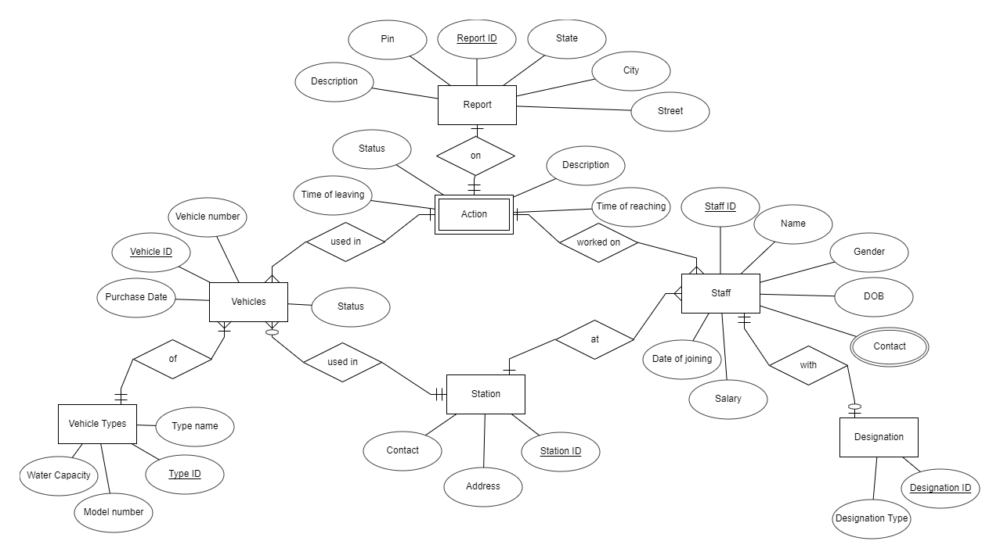{width="8.184133858267716in"
height="4.582608267716536in"}

**Database model**

1.  **Login Page**

    class LoginPage(QMainWindow, login\_ui):

    def \_\_init\_\_(self):

    QMainWindow.\_\_init\_\_(self)

    self.setupUi(self)

    self.Handle\_Buttons()

    self.style\_3()

    def Handle\_Buttons(self):

    self.createAccount.clicked.connect(self.create)

    self.cr\_clear.clicked.connect(self.create\_clr)

    self.log\_in.clicked.connect(self.login)

    self.log\_clear.clicked.connect(self.login\_clr)

    def adminpass(self):

    self.window = MainApp()

    self.close()

    self.window.show()

    def userpass(self):

    self.window = UserPage(self)

    self.close()

    self.window.show()

    def create(self):

    self.db = pymysql.connect(host=\'localhost\', user= \'root\',
    password= \'admin\', db=\'firestation\')

    self.cur = self.db.cursor()

    nam = self.firstname.text()

    user = self.cr\_username.text()

    passw = self.cr\_password.text()

    cont = self.contact\_line.text()

    if self.type\_admin.isChecked():

    self.cur.execute(\'\'\'INSERT INTO admins (name,username,password)

    VALUES (%s,%s,%s);

    \'\'\',(nam,user,passw))

    self.db.commit()

    self.statusBar().showMessage(\'Account Created\')

    if self.type\_user.isChecked():

    self.cur.execute(\'\'\'INSERT INTO users
    (name,username,password,contact)

    VALUES (%s,%s,%s,%s);

    \'\'\',(nam,user,passw,cont))

    self.db.commit()

    self.statusBar().showMessage(\'Account Created\')

    self.firstname.setText(\'\')

    self.cr\_username.setText(\'\')

    self.cr\_password.setText(\'\')

    self.contact\_line.setText(\'\')

    def create\_clr(self):

    self.firstname.setText(\'\')

    self.cr\_username.setText(\'\')

    self.cr\_password.setText(\'\')

    self.contact\_line.setText(\'\')

    def login(self):

    self.db = pymysql.connect(host=\'localhost\', user= \'root\',
    password= \'admin\', db=\'firestation\')

    self.cur = self.db.cursor()

    user = self.log\_username.text()

    password = self.log\_password.text()

    self.cur.execute(\'\'\'SELECT \* FROM admins WHERE username=%s AND
    password=%s;\'\'\',(user,password))

    data = self.cur.fetchone()

    if data != None:

    self.adminpass()

    else:

    self.cur.execute(\'\'\'SELECT \* FROM users WHERE username=%s AND
    password=%s;\'\'\',(user,password))

    self.data = self.cur.fetchone()

    if self.data != None:

    print(\'found\')

    self.userpass()

    else:

    self.label\_11.setText(\'Make sure you entered your username and
    password correctly\')

    def login\_clr(self):

    self.log\_username.setText(\'\')

    self.log\_password.setText(\'\')

    **Admin Login Page**

    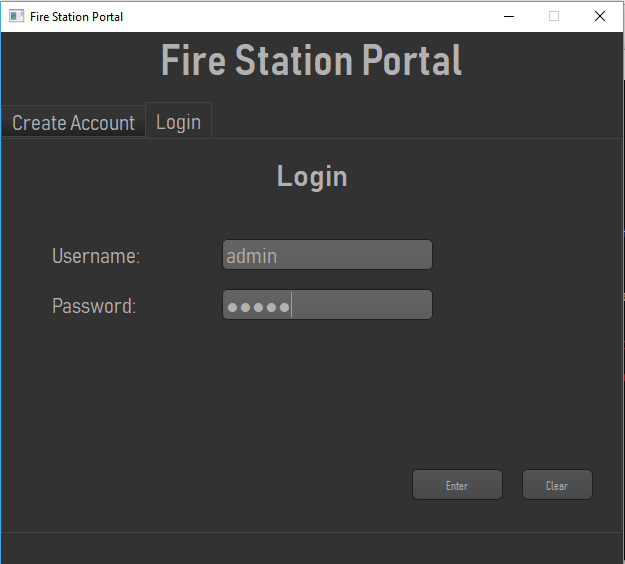{width="4.33043416447944in"
    height="3.907750437445319in"}

    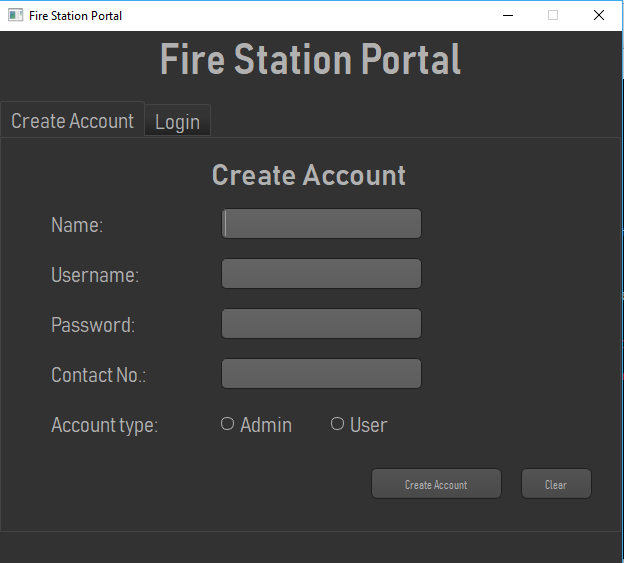{width="4.382608267716535in"
    height="3.9543503937007873in"}

    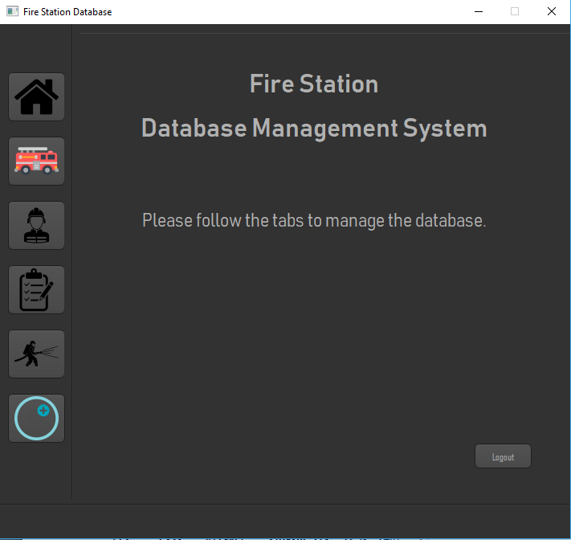{width="4.379296806649169in"
    height="4.139130577427822in"}

    **User Login Page**

    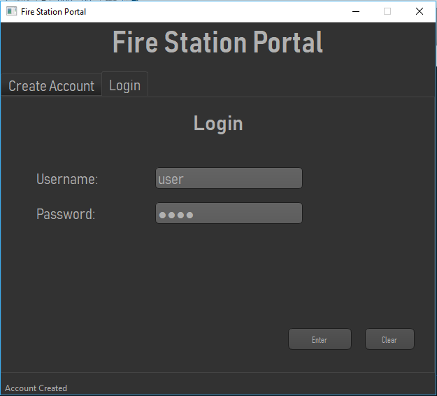{width="4.359318678915136in"
    height="3.9478258967629047in"}

    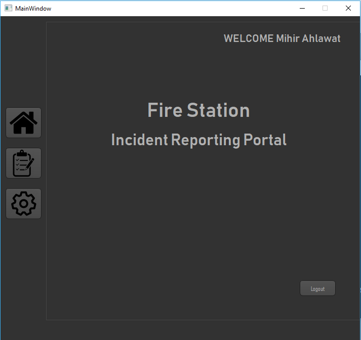{width="4.347825896762904in"
    height="4.097823709536308in"}

2.  **Change User Account settings**

    \#\#\#\#\#\# User Settings \#\#\#\#\#\#

    def update\_user(self):

    self.label\_12.setText(\'\')

    self.db = pymysql.connect(host=\'localhost\', user= \'root\',
    password= \'admin\', db=\'firestation\')

    self.cur = self.db.cursor()

    nam = self.firstname.text()

    passw = self.cr\_password.text()

    passw2 = self.cr\_password\_2.text()

    cont = self.contact\_line.text()

    if passw == \'\' or passw2 == \'\':

    self.label\_12.setText(\'Passwords cannot be empty\')

    else:

    if passw == passw2:

    self.cur.execute(\'\'\' UPDATE users SET
    name=%s,password=%s,contact=%s

    WHERE username=%s;

    \'\'\',(nam,passw,cont,self.user\[1\]))

    self.db.commit()

    self.statusBar().showMessage(\'Details Updated\')

    else:

    self.label\_12.setText(\'Passwords do not match\')

    self.cr\_password.setText(\'\')

    self.cr\_password\_2.setText(\'\')

    def update\_clr(self):

    self.cr\_password.setText(\'\')

    self.cr\_password\_2.setText(\'\')

    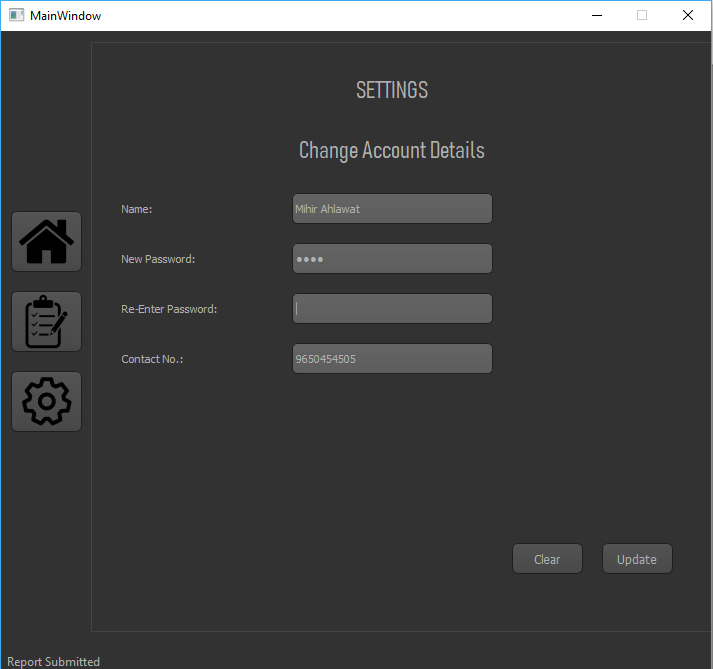{width="4.382608267716535in"
    height="4.112155511811023in"}

3.  **Add a fire report**

    \#\#\#\#\#\#\#\#\#\# Report \#\#\#\#\#\#\#\#\#

    def add\_report(self):

    self.db = pymysql.connect(host=\'localhost\', user= \'root\',
    password= \'admin\', db=\'firestation\')

    self.cur = self.db.cursor()

    street = self.lineEdit\_22.text()

    city = self.lineEdit\_20.text()

    state = self.lineEdit\_23.text()

    pin = self.lineEdit\_21.text()

    descrip = self.textEdit.toPlainText()

    date = time.strftime(\'%Y-%m-%d %H:%M:%S\')

    self.cur.execute(\'\'\'INSERT INTO reports
    (STREET\_ADDR,CITY,STATE,PINCODE,DESCRIP,INFO\_NAME,INFO\_NUM,DATE\_TIME)

    VALUES (%s,%s,%s,%s,%s,%s,%s,%s);

    \'\'\',(street,city,state,pin,descrip,self.user\[0\],self.user\[3\],date))

    self.db.commit()

    self.statusBar().showMessage(\'Report Submitted\')

    self.lineEdit\_22.setText(\'\')

    self.lineEdit\_20.setText(\'\')

    self.lineEdit\_23.setText(\'\')

    self.lineEdit\_21.setText(\'\')

    self.textEdit.setPlainText(\'\')

    def add\_clr(self):

    self.lineEdit\_22.setText(\'\')

    self.lineEdit\_20.setText(\'\')

    self.lineEdit\_23.setText(\'\')

    self.lineEdit\_21.setText(\'\')

    self.textEdit.setPlainText(\'\')

    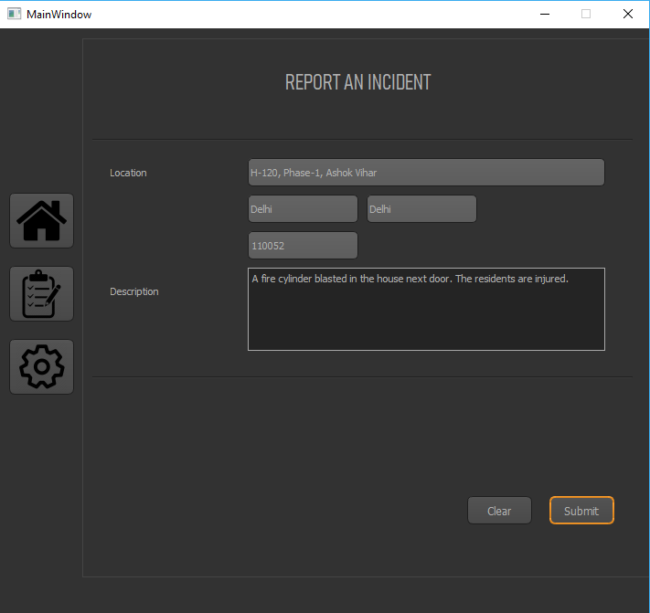{width="3.6954899387576554in"
    height="3.4875in"}

4.  **Modify Vehicle Data**

    \#\#\#\#\#\#\#\#\# Vehicles \#\#\#\#\#\#\#\#

    def add\_vehicle(self):

    self.db = pymysql.connect(host=\'localhost\', user= \'root\',
    password= \'admin\', db=\'firestation\')

    self.cur = self.db.cursor()

    vehicle\_number = self.lineEdit\_5.text()

    station\_id = self.comboBox\_9.currentText()

    vehicle\_type = self.comboBox.currentText()

    model\_number = self.lineEdit\_6.text()

    status = self.comboBox\_5.currentText()

    water\_cap = self.lineEdit\_10.text()

    purchase = self.lineEdit\_7.text()

    self.cur.execute(\'\'\'INSERT INTO vehicles
    (VEHICLE\_NUM,VEHICLE\_STATION,VEHICLE\_TYPE,MODEL\_NO,VEHICLE\_STATUS,WATER\_CAP,PURCHASE)

    VALUES (%s,%s,%s,%s,%s,%s,%s);

    \'\'\',(vehicle\_number,station\_id,vehicle\_type,model\_number,status,water\_cap,purchase))

    self.db.commit()

    self.statusBar().showMessage(\'New Vehicle Added\')

    self.lineEdit\_5.setText(\'\')

    self.comboBox\_9.setCurrentIndex(0)

    self.comboBox.setCurrentIndex(0)

    self.lineEdit\_6.setText(\'\')

    self.comboBox\_5.setCurrentIndex(0)

    self.lineEdit\_10.setText(\'\')

    self.lineEdit\_7.setText(\'\')

    def search\_vehicle(self):

    self.db = pymysql.connect(host=\'localhost\', user= \'root\',
    password= \'admin\', db=\'firestation\')

    self.cur = self.db.cursor()

    id = self.lineEdit\_12.text()

    sql = \'\'\' SELECT \* FROM vehicles WHERE VEHICLE\_ID = %s;\'\'\'

    self.cur.execute(sql,\[(id)\])

    data = self.cur.fetchone()

    if data != None:

    self.lineEdit\_26.setText(data\[1\])

    self.comboBox\_8.setCurrentText(data\[2\])

    self.comboBox\_3.setCurrentText(data\[3\])

    self.lineEdit\_18.setText(data\[4\])

    self.comboBox\_6.setCurrentText(data\[5\])

    self.lineEdit\_11.setText(data\[6\])

    self.lineEdit\_8.setText(data\[7\])

    else:

    QMessageBox.critical(self,\'Error\',\'Please Enter A Valid Vehicle
    ID\')

    def update\_vehicle(self):

    self.db = pymysql.connect(host=\'localhost\', user= \'root\',
    password= \'admin\', db=\'firestation\')

    self.cur = self.db.cursor()

    vehicle\_id = self.lineEdit\_12.text()

    vehicle\_number = self.lineEdit\_26.text()

    station\_id = self.comboBox\_8.currentText()

    vehicle\_type = self.comboBox\_3.currentText()

    model\_number = self.lineEdit\_18.text()

    status = self.comboBox\_6.currentText()

    water\_cap = self.lineEdit\_11.text()

    purchase = self.lineEdit\_8.text()

    self.cur.execute(\'\'\'UPDATE vehicles SET VEHICLE\_NUM =
    %s,VEHICLE\_STATION = %s,VEHICLE\_TYPE = %s,MODEL\_NO =
    %s,VEHICLE\_STATUS = %s,WATER\_CAP = %s,PURCHASE = %s

    WHERE VEHICLE\_ID = %s;

    \'\'\',(vehicle\_number,station\_id,vehicle\_type,model\_number,status,water\_cap,purchase,vehicle\_id))

    self.db.commit()

    self.statusBar().showMessage(\'Vehicle Data Updated\')

    self.lineEdit\_12.setText(\'\')

    self.lineEdit\_26.setText(\'\')

    self.comboBox\_8.setCurrentIndex(0)

    self.comboBox\_3.setCurrentIndex(0)

    self.lineEdit\_18.setText(\'\')

    self.comboBox\_6.setCurrentIndex(0)

    self.lineEdit\_11.setText(\'\')

    self.lineEdit\_8.setText(\'\')

    def delete\_vehicle(self):

    self.db = pymysql.connect(host=\'localhost\', user= \'root\',
    password= \'admin\', db=\'firestation\')

    self.cur = self.db.cursor()

    id = self.lineEdit\_12.text()

    warning = QMessageBox.warning(self, \'Delete Vehicle\', \'Are you
    sure you want to delete this vehicle?\', QMessageBox.Yes \|
    QMessageBox.No)

    if warning == QMessageBox.Yes :

    sql = \'\'\' DELETE FROM vehicles WHERE VEHICLE\_ID = %s;\'\'\'

    self.cur.execute(sql, \[(id)\])

    self.db.commit()

    self.statusBar().showMessage(\'Vehicle Deleted\')

    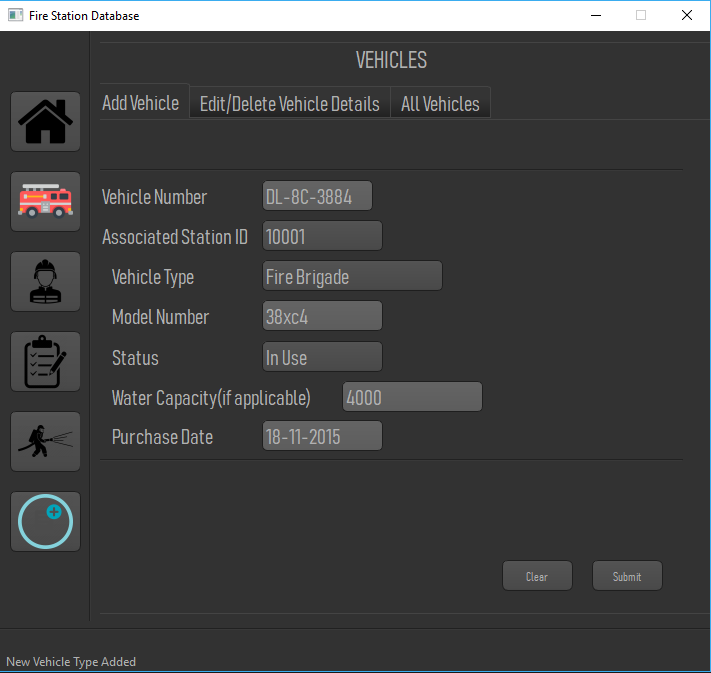{width="4.436937882764655in"
    height="4.2in"}

    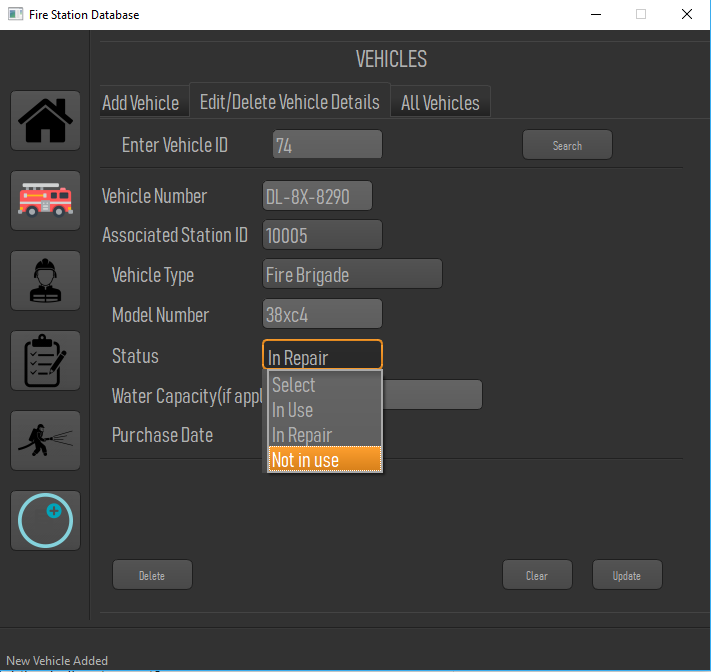{width="4.406897419072616in"
    height="4.165217629046369in"}

    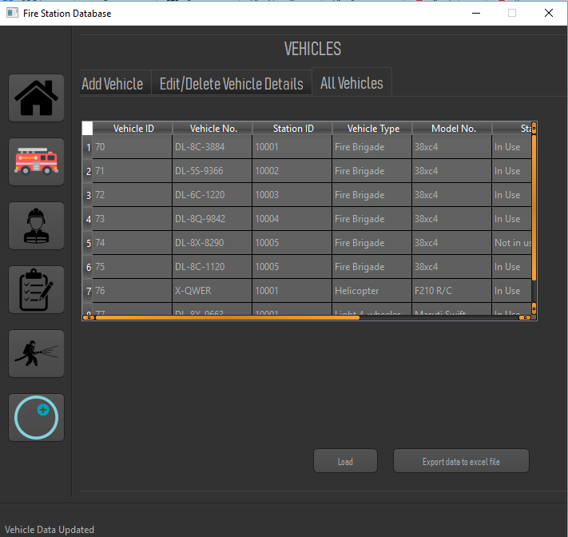{width="4.222293307086614in"
    height="3.9907360017497813in"}

5.  **Modify Staff Data**

    \#\#\#\#\#\#\#\#\# Similar code as vehicle updating
    \#\#\#\#\#\#\#\#\#

    {width="4.384861111111111in"
    height="4.138073053368329in"}

    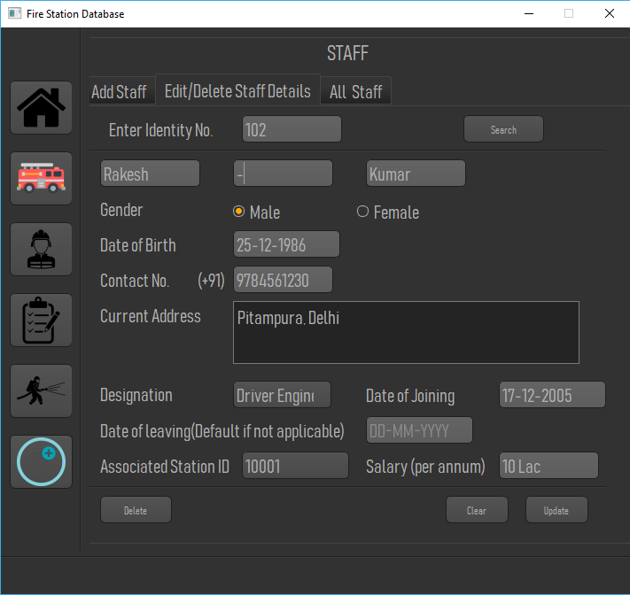{width="4.370097331583552in"
    height="4.130435258092739in"}

    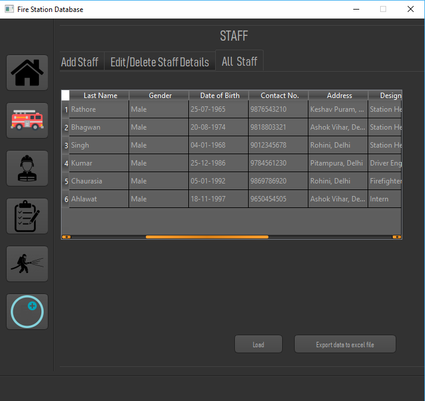{width="4.3697900262467195in"
    height="4.123851706036746in"}

6.  **Reports Data**

    \#\#\#\#\#\#\#\#\# Only viewing the list of reports is allowed
    \#\#\#\#\#\#\#\#\#

    \#\#\#\#\#\#\#\#\# Reports \#\#\#\#\#\#\#\#\#

    def load\_report(self):

    self.db = pymysql.connect(host=\'localhost\', user= \'root\',
    password= \'admin\', db=\'firestation\')

    self.cur = self.db.cursor()

    self.cur.execute(\'\'\' SELECT \* FROM reports \'\'\')

    data = self.cur.fetchall()

    self.tableWidget\_3.setRowCount(0)

    for row, form in enumerate(data):

    row\_pos = self.tableWidget\_3.rowCount()

    self.tableWidget\_3.insertRow(row\_pos)

    for col, item in enumerate(form):

    self.tableWidget\_3.setItem(row, col, QTableWidgetItem(str(item)))

    col += 1

    def export\_report(self):

    self.db = pymysql.connect(host=\'localhost\', user= \'root\',
    password= \'admin\', db=\'firestation\')

    self.cur = self.db.cursor()

    self.cur.execute(\'\'\' SELECT \* FROM reports \'\'\')

    data = self.cur.fetchall()

    wb = Workbook(\'Reports.xlsx\')

    sheet1 = wb.add\_worksheet()

    sheet1.write(0,0,\'Report ID\')

    sheet1.write(0,1,\'Street Address\')

    sheet1.write(0,2,\'City\')

    sheet1.write(0,3,\'State\')

    sheet1.write(0,4,\'Pincode\')

    sheet1.write(0,5,\'Description\')

    sheet1.write(0,6,\'Informant Name\')

    sheet1.write(0,7,\'Informant Contact\')

    sheet1.write(0,8,\'Date and Time\')

    row\_num = 1

    for row in data:

    col\_num = 0

    for item in row:

    sheet1.write(row\_num, col\_num, str(item))

    col\_num += 1

    row\_num += 1

    wb.close()

    self.statusBar().showMessage(\'Reports Exported Successfully\')

    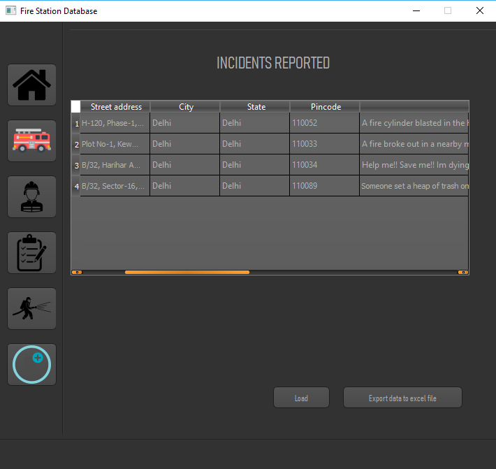{width="4.295651793525809in"
    height="4.059595363079615in"}

7.  **Modify Action on Reports Data**

    \#\#\#\#\#\#\#\#\# Same as Vehicle updating \#\#\#\#\#\#\#\#\#

    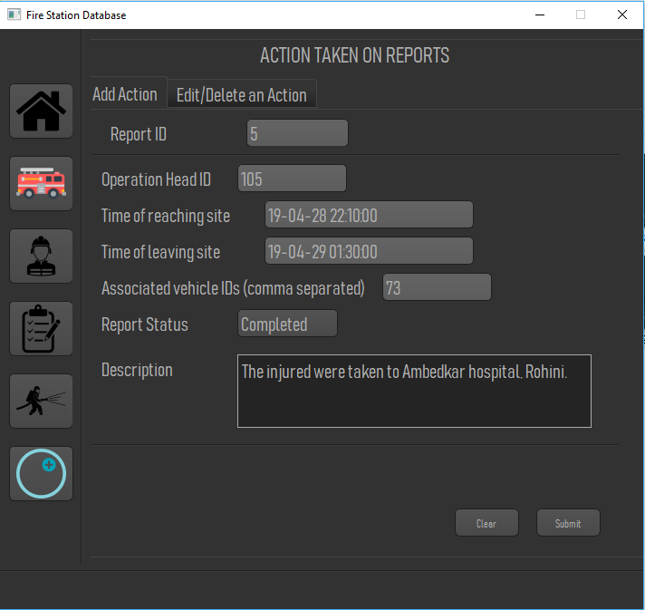{width="4.33043416447944in"
    height="4.093424103237095in"}

    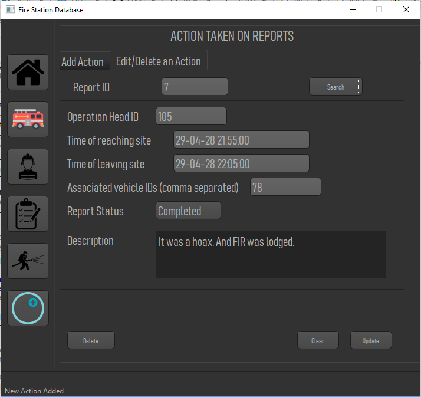{width="4.409074803149606in"
    height="4.156038932633421in"}

8.  **Update data for drop down menus**

    \#\#\#\#\#\#\#\#\# Settings \#\#\#\#\#\#\#\#

    \#\# Add fire stations \#\#

    def add\_station(self):

    self.db = pymysql.connect(host=\'localhost\', user= \'root\',
    password= \'admin\', db=\'firestation\')

    self.cur = self.db.cursor()

    station\_id = self.lineEdit\_27.text()

    station\_num = self.lineEdit\_29.text()

    station\_addr = self.plainTextEdit\_5.toPlainText()

    self.cur.execute(\'\'\'

    INSERT INTO stations (STATION\_ID,STATION\_CONTACT,STATION\_ADDR)
    VALUES (%s,%s,%s)

    \'\'\', (station\_id,station\_num,station\_addr) )

    self.db.commit()

    self.lineEdit\_27.setText(\'\')

    self.lineEdit\_29.setText(\'\')

    self.plainTextEdit\_5.setPlainText(\'\')

    self.show\_station()

    self.statusBar().showMessage(\'New Station Added\')

    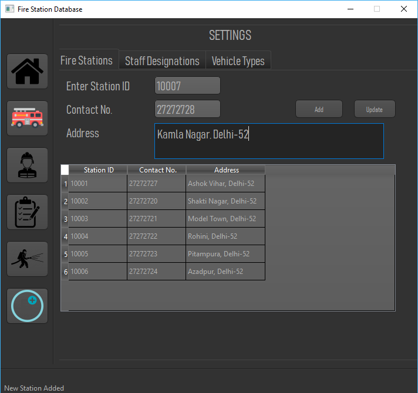{width="4.804946412948381in"
    height="4.521738845144357in"}

    \#\# Add designations \#\#

    def add\_designation(self):

    self.db = pymysql.connect(host=\'localhost\', user= \'root\',
    password= \'admin\', db=\'firestation\')

    self.cur = self.db.cursor()

    desig = self.lineEdit\_30.text()

    self.cur.execute(\'\'\'

    INSERT INTO designation (DESIG\_NAME) VALUES (%s)

    \'\'\', (desig,) )

    self.db.commit()

    self.lineEdit\_30.setText(\'\')

    self.show\_designation()

    self.statusBar().showMessage(\'New Designation Added\')

    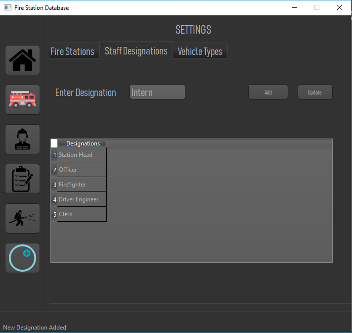{width="4.713043525809274in"
    height="4.455095144356956in"}

    \#\# Add vehicle type \#\#

    def add\_vehicle\_type(self):

    self.db = pymysql.connect(host=\'localhost\', user= \'root\',
    password= \'admin\', db=\'firestation\')

    self.cur = self.db.cursor()

    veh\_type = self.lineEdit\_31.text()

    self.cur.execute(\'\'\'

    INSERT INTO vehicle\_type (TYPE\_NAME) VALUES (%s)

    \'\'\', (veh\_type,) )

    self.db.commit()

    self.lineEdit\_31.setText(\'\')

    self.show\_vehicle\_type()

    self.statusBar().showMessage(\'New Vehicle Type Added\')

    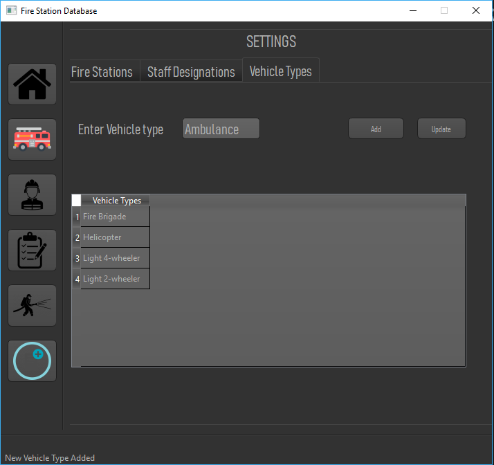{width="4.652174103237096in"
    height="4.3784864391951in"}
